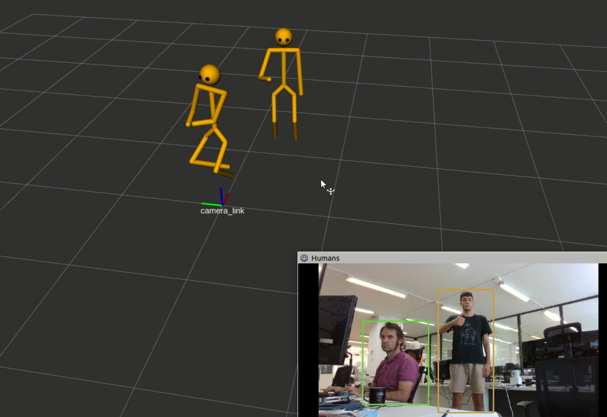

hri_fullbody
=======================

Overview
--------

`hri_fullbody` is a [ROS4HRI](https://wiki.ros.org/hri)-compatible
3D body pose estimation node.

It is built on top of [Google Mediapipe 3D body pose estimation](https://google.github.io/mediapipe/solutions/pose.html).

The node provides the 3D pose estimation for the detected humans 
in the scene, implementing a robust solution to self-occlusions.

This node can be used in two different modes: single body and multi-body.
In the former case, the node performs the whole body detection pipeline, 
publishing information under the ROS4HRI naming convention regarding
the body id (on the `/humans/bodies/tracked` topic), the body bounding box,
and the jointstate of the body's skeleton. In the latter, the node only 
publishes jointstate information, expecting body detection to be performed
by another node and subscribing to `/humans/bodies/tracked` to read the ids
of the currently tracked bodies.

These two modes are required since Mediapipe body estimation
is not able to estimate more than one body pose per frame. 
Therefore, in case we want more than one body pose estimated, 
the adopted strategy is to rely on some other package implementing a human
body detection (and tracking in the best case) algorithm.
Such package should provide the `hri_fullbody detect` node the IDs of the
detected bodies and the relative images, cropped from the original image
following the detected bounding boxes.

To estimate the body position, the node does not need a RGB-D camera,
only RGB is required. However, using RGB-D camera provides a more 
accurate depth estimation.

**Important**: to estimate the body depth without using a depth sensor, 
a calibrated RGB camera is required. 
You can follow [this tutorial](http://wiki.ros.org/camera_calibration/Tutorials/MonocularCalibration)
to properly calibrate your camera.

Launch
------

`roslaunch hri_fullbody hri_fullbody.launch <parameters>`

ROS API
-------

### Parameters

#### Node parameters:

- `~single_body` (default: `True`): whether or not running in single
  body mode (see above for the single body vs multi-body modes). 
- `~use_depth` (default: `False`): whether or not to rely on depth images 
  for estimating body movement in the scene. When this is `False`, the node
  estimates the body position in the scene solving a P6P problem for the
  face and approximating the position from this, using pinhole camera
  model geometry. 
- `~stickman_debug` (default: `False`): whether or not to publish frames
  representing the body skeleton directly using the raw results from mediapipe
  3D body pose estimation. These debug frames are *not* oriented to align 
  with the body links (ie, only the 3D location of the frame is useful).

#### hri_fullbody.launch parameters:

- `single_body`: equivalent to `~single_body` node parameter.
- `use_depth`: equivalent to `~use_depth` node parameter.
- `stickman_debug`: equivalent to `~stickman_debug` node parameter.
- `rgb_camera` (default: `/camera/color`): rgb camera topics namespace.
- `rgb_camera_topic` (default: `$(arg rgb_camera)/image_raw`): rgb camera
  raw image topic. 
- `rgb_camera_info` (default: `$(arg rgb_camera)/camera_info`): rgb camera
  info topic.
- `depth_camera` (default: `/camera/depth`): depth camera topics namespace. 
- `depth_camera_topic` (default: `$(arg depth_camera)/image_rect_raw`): depth 
  camera rectified raw image topic.
- `depth_camera_info` (default: `$(arg depth_camera)/camera_info`): depth 
  camera info topic.

### Topics

`hri_fullbody` follows the ROS4HRI conventions (REP-155). In particular, 
refer to the REP to know the list and position of the 2D/3D skeleton 
points published by the node.

#### Subscribed topics

- `/camera_info`
  ([sensor_msgs/CameraInfo](http://docs.ros.org/en/noetic/api/sensor_msgs/html/msg/CameraInfo.html)):
  rgb camera meta information
- `/depth_image`
  ([sensor_msgs/Image](http://docs.ros.org/en/api/sensor_msgs/html/msg/Image.html)):
  depth image used to estimate the 3D body position with respect to the camera.
- `/depth_info`
  ([sensor_msgs/CameraInfo](http://docs.ros.org/en/noetic/api/sensor_msgs/html/msg/CameraInfo.html)):
  depth camera meta information

##### Single body mode only:

- `/image`
  ([sensor_msgs/Image](http://docs.ros.org/en/api/sensor_msgs/html/msg/Image.html)):
  rgb image, processed for body detection and 3D body pose estimation.

##### Multi-body mode only:

- `/humans/bodies/tracked`
  ([hri_msgs/IdsList](http://docs.ros.org/en/api/hri_msgs/html/msg/IdsList.html)):
  list of the bodies currently detected.
- `/humans/bodies/<body_id>/cropped`
  ([sensor_msgs/Image](http://docs.ros.org/en/api/sensor_msgs/html/msg/Image.html)):
  image used to estimate the 3D body pose.
- `/humans/bodies/<body_id>/roi`
  ([hri_msgs/NormalizedRegionOfInterest2D](http://docs.ros.org/en/noetic/api/hri_msgs/html/msg/NormalizedRegionOfInterest2D.html)):
  body bounding box in normalized image coordinates.

#### Published topics

- `/humans/bodies/<body_id>/skeleton2d`
  ([hri_msgs/Skeleton2D](http://docs.ros.org/en/api/hri_msgs/html/msg/Skeleton2D.html)):
  detected 2D skeleton points.
- `/humans/bodies/<body_id>/joint_states`
  ([sensor_msgs/JointState](http://docs.ros.org/en/lunar/api/sensor_msgs/html/msg/JointState.html)):
  skeleton joints state.
- `/humans/bodies/<body_id>/position`:
  ([geometry_msgs/PointStamped](http://docs.ros.org/en/lunar/api/geometry_msgs/html/msg/PointStamped.html)):
  filtered body position, representing the point between the hips of the tracked body. Only published 
  when `use_depth = True`.
- `/humans/bodies/<body_id>/velocity`:
  ([geometry_msgs/TwistStamped](http://docs.ros.org/en/lunar/api/geometry_msgs/html/msg/TwistStamped.html)):
  filtered body velocity. Only published when `use_depth = True`.

##### Single body mode only:

- `/humans/bodies/tracked`
  ([hri_msgs/IdsList](http://docs.ros.org/en/api/hri_msgs/html/msg/IdsList.html)):
  list of the bodies currently detected. There will be only
  one body in the list.
- `/humans/bodies/<body_id>/roi`
  ([hri_msgs/NormalizedRegionOfInterest2D](http://docs.ros.org/en/noetic/api/hri_msgs/html/msg/NormalizedRegionOfInterest2D.html)):
  body bounding box in normalized image coordinates.

Visualization
-------------

It is possible to visualize the results of the body pose estimation 
in rviz using the [hri_rviz](https://github.com/ros4hri/hri_rviz) 
Skeleton plugin. A visualization example is reported in the image above. 

